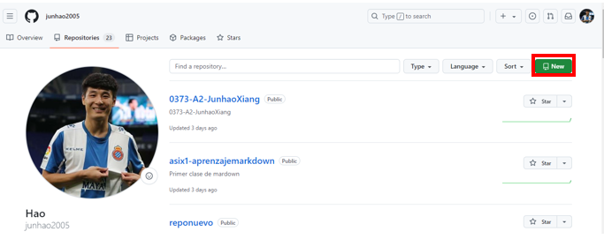
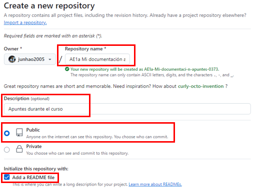
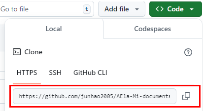
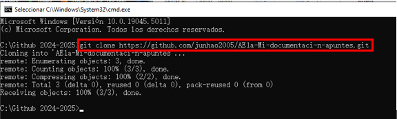
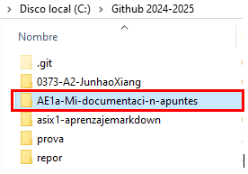

# AE1a-Mi-documentaci-n-apuntes
Apuntes durante el curso

# Cracion de repositorio y clonacion con cmd
Para crear un repositorio tenemos que entrar al 'Your repositories' una vez que entremos al repositorio le damos al 'New'.
<br>


Y nos abrira esta ventana y desde aqui añadimos el nombre de repositorio, añadir descripcion, que sea Public, seleccionamos Add a REAME file y le damos al crear
<br>


Una vez que creamos el repositorio le damos al "Code" y copiamos la URL
<br>


Y en siguiente paso es entrar al cmd y nos vamos al directorio donde guardamos todos los repositories, desde aqui usamos el comando: git clone (URL que hemos copiado antes). Este comando sirve para clonar el repositorio.
<br>


Resultado: aqui podemos ver que ya esta clonado.
<br>

<br>
## Comando basico de git
* git init: para iniciar 
* git branch: para ver la rama donde trabajamos
* git branch -M main: situar el repositorio en main
* git add .: para añadir todos los archivos
* git commit -m "añadir comentario": sirve para añadir commit
* git push origin main: subir el cambio
* git remote add origin "link de URL": es sincronizar repositorio local con el web
* git pull: bajar el cambio
* git clone: sirve para clonar
<br>

# Comando basico de markdown

Mostracion en markdown: (niveles de encabezado)

```
# Perimer nivel de encabezado
## Segundo nivel de encabezados
### Tercero nivel de encabezados
#### Quarto nivel de encabezados
##### Quinto nivel de encabezados
###### Sexto nivel de encabezados
```
Resultado: 
# Perimer nivel de encabezado
## Segundo nivel de encabezados
### Tercero nivel de encabezados
#### Quarto nivel de encabezados
##### Quinto nivel de encabezados
###### Sexto nivel de encabezados


## Coamdo para poner en negrita y cursiva

Mostracion en markdown:
```
 *0373* del ciclo de **ASIX** o DAW del curso _2425_.
```
Resultado:
 *0373* del ciclo de **ASIX** o DAW del curso _2425_.
 

## Tabla ordenada y desordenada
Mostracion desde markdown:
```
1. Primer punto de la lista
    1. Primer elemento de la sublista 1
    2. Segundo elemento de la sublista 1
2. Sgundo punto de la lista
    * Primer elemento de la sublista 1
    * Segundo elemento de la sublista 1
3. Tercer punto de la lista

* Primer punto de lista desordenada
- Segundo punto de lista desordenada
+ Tercer punto de lista desordenada
```
Resultado:
1. Primer punto de la lista
    1. Primer elemento de la sublista 1
    2. Segundo elemento de la sublista 1
2. Sgundo punto de la lista
    * Primer elemento de la sublista 1
    * Segundo elemento de la sublista 1
3. Tercer punto de la lista

* Primer punto de lista desordenada
- Segundo punto de lista desordenada
+ Tercer punto de lista desordenada


**Como mostrar codigo en un repositorio**
usando este simbolo "```" 

```
<!DOCTYPE html>
<html lang="en">
<head>
    <meta charset="UTF-8">
    <meta name="viewport" content="width=device-width, initial-scale=1.0">
    <title>Minds of Tomorrow</title>
    <link href="./css/estilos.css" rel="stylesheet" type="text/css">
    <style>
        @import url('https://fonts.googleapis.com/css2?family=Bebas+Neue&family=Chakra+Petch:ital,wght@0,300;0,400;0,500;0,600;0,700;1,300;1,400;1,500;1,600;1,700&family=Honk:MORF,SHLN@5,66.7&family=Kanit:ital,wght@0,100;0,200;0,300;0,400;0,500;0,600;0,700;0,800;0,900;1,100;1,200;1,300;1,400;1,500;1,600;1,700;1,800;1,900&family=Magra:wght@400;700&family=Nunito:ital,wght@0,200..1000;1,200..1000&family=Permanent+Marker&family=Varela+Round&display=swap');
    </style>
```
## Añadir url

```
[textoClicable](URL "Titulo opcional")

[Pagina web de Joan23](https://www.fje.edu/ca/jesuites-bellvitge "Titulo opcional")
```

### Como poner una imagen

```


```

### Como poner tabla
Mostracion desde markdown:
```
|Titulo 1 | Titulo 2 | Titulo 3 |
|-----------|:----------:|--------------|
|SMX2 |Curso 2324|25| 
|**ASIX1** |Curso 2425|33| 
|DAW2 |Curso 2425|35| 
```
Resultado:
|Titulo 1 | Titulo 2 | Titulo 3 |
|-----------|:----------:|--------------|
|SMX2 |Curso 2324|25| 
|**ASIX1** |Curso 2425|33| 
|DAW2 |Curso 2425|35| 

# ¿Que es HTML?
HTML (HyperText Markup Language) es el lenguaje de marcado utilizado para estructurar y presentar contenido en la web. Define la estructura de una página web mediante etiquetas.
<br>

# Estructura Básica de un Documento HTML
```
<!DOCTYPE html>
<html lang="es">
<head>
    <meta charset="UTF-8">
    <meta name="viewport" content="width=device-width, initial-scale=1.0">
    <title>Título de la Página</title>
</head>
<body>
    
</body>
</html>
```
## Explicacion: 

- **``<!DOCTYPE html>``:** Define el tipo de documento, en este caso es HTML5.
- **``<html>``:** Etiqueta raíz que contiene todo el contenido de la página.
- **``<head>``:** Contiene metadatos sobre el documento (título, codificación, etc.).
- **``<meta charset="UTF-8">``:** Define la codificación de caracteres, importante para caracteres especiales. 
- **``<title>``:** Título de la página que aparece en la pestaña del navegador.
- **``<body>``:** Contiene el contenido visible de la página (texto, imágenes, enlaces, etc.).

## Etiquetas Básicas de HTML

|Comando | Funcion | 
|-----------|:----------:|
|``<h1>, <h2>, ..., <h6>``|Títulos de diferentes tamaños (h1 es el más grande, h6 el más pequeño).|
|``<p>``|Para texto|
|``<br>``|Salto de línea.|
|``<hr>``|Línea horizontal.|
|``<b> o <strong>``|Texto en negrita|
|``<i> o <em>``|Texto en cursiva.|
|``<u>``|Texto subrayado.|
|``<li>``|Se lleva en cada elemento de la lista|
|``<ul>``|lista desordenada|
|``<ol>``|lista ordenada|


## Ejemplo de la lista desordenada

Mostracion en html:

```
<ul>
    <li>Elemento 1</li>
    <li>Elemento 2</li>
</ul>
```

Resultado:

<ul>
    <li>Elemento 1</li>
    <li>Elemento 2</li>
</ul>

## Ejemplo de la lista ordenada
Mostracion en html:
```
<ol>
    <li>Primer elemento</li>
    <li>Segundo elemento</li>
</ol>
```
Resultado:
<ol>
    <li>Primer elemento</li>
    <li>Segundo elemento</li>
</ol>

<br>

## Enlaces
Usamos este comando para crear un enlace: ```<a href="url">Texto del enlace</a>```

html:
```
<a href="https://es.wikipedia.org/wiki/Lionel_Messi">Messi</a>
```

Resultado: 

<a href="https://es.wikipedia.org/wiki/Lionel_Messi">Messi</a>

## Imagenes
Usamos este comando para mostrar un imagen: ``````

html:
```

```
Resultado: 


