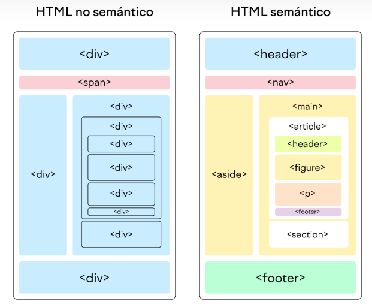

# AE1a-Mi-documentaci-n-apuntes

## Index:

1. [GITHUB](#Github)
2. [Markdown](#Markdown)
3. [HTML](#HTML)
4. [CSS](#CSS)
5. [Diseño responsive](#Diseño_responsive)

# Github
Github es una página web donde programadores guardan su código y trabajan juntos en proyectos. Funciona como una "nube" para el código, permitiendo que varios programadores hagan cambios sin borrar el trabajo de otros, ya que guarda todo el historial de cambios. También ayuda a discutir mejoras, revisar el trabajo y organizar tareas, haciendo más fácil crear software en equipo.
## Cracion de repositorio y clonacion con cmd
Para crear un repositorio tenemos que entrar al 'Your repositories' una vez que entremos al repositorio le damos al 'New'.
<br>


Y nos abrira esta ventana y desde aqui añadimos el nombre de repositorio, añadir descripcion, que sea Public, seleccionamos Add a REAME file y le damos al crear
<br>


Una vez que creamos el repositorio le damos al "Code" y copiamos la URL
<br>


Y en siguiente paso es entrar al cmd y nos vamos al directorio donde guardamos todos los repositories, desde aqui usamos el comando: git clone (URL que hemos copiado antes). Este comando sirve para clonar el repositorio.
<br>


Resultado: aqui podemos ver que ya esta clonado.
<br>

<br>
## Comando basico de git
* **git init**: para iniciar 
* **git branch**: para ver la rama donde trabajamos
* **git branch -M main**: situar el repositorio en main
* **git add .**: para añadir todos los archivos
* **git commit -m "añadir comentario"**: sirve para añadir commit
* **git push origin main**: subir el cambio
* **git remote add origin "link de URL"**: es sincronizar repositorio local con el web
* **git pull**: bajar el cambio
* **git clone**: sirve para clonar
<br>

# Markdown
Markdown es un lenguaje de marcado ligero que se utiliza para formatear texto de manera sencilla y rápida. Fue creado por John Gruber en 2004 con el objetivo de que las personas pudieran escribir de forma legible y fácil de escribir, mientras que al mismo tiempo generaba contenido que pudiera convertirse en HTML (el lenguaje utilizado para las páginas web).

# Comando basico de markdown

Mostracion en markdown: (niveles de encabezado)

```
# Perimer nivel de encabezado
## Segundo nivel de encabezados
### Tercero nivel de encabezados
#### Quarto nivel de encabezados
##### Quinto nivel de encabezados
###### Sexto nivel de encabezados
```
Resultado: 
# Perimer nivel de encabezado
## Segundo nivel de encabezados
### Tercero nivel de encabezados
#### Quarto nivel de encabezados
##### Quinto nivel de encabezados
###### Sexto nivel de encabezados


## Coamdo para poner en negrita y cursiva

Para ponerlo en negrita usamos esto ``** **`` y para cursiva podemos usar ``* *`` o ``_ _``.

Mostracion en markdown:
```
 *0373* del ciclo de **ASIX** o DAW del curso _2425_.
```
Resultado:
 *0373* del ciclo de **ASIX** o DAW del curso _2425_.
 

## Tabla ordenada y desordenada
Mostracion desde markdown: (los ordenada llevan numeros y los desordenadas usan simbolos)
```
1. Primer punto de la lista
    1. Primer elemento de la sublista 1
    2. Segundo elemento de la sublista 1
2. Sgundo punto de la lista
    * Primer elemento de la sublista 1
    * Segundo elemento de la sublista 1
3. Tercer punto de la lista

* Primer punto de lista desordenada
- Segundo punto de lista desordenada
+ Tercer punto de lista desordenada
```
Resultado:
1. Primer punto de la lista
    1. Primer elemento de la sublista 1
    2. Segundo elemento de la sublista 1
2. Sgundo punto de la lista
    * Primer elemento de la sublista 1
    * Segundo elemento de la sublista 1
3. Tercer punto de la lista

* Primer punto de lista desordenada
- Segundo punto de lista desordenada
+ Tercer punto de lista desordenada


**Como mostrar codigo en un repositorio**
usando este simbolo "```" para mostrar los codigos.

```
<!DOCTYPE html>
<html lang="en">
<head>
    <meta charset="UTF-8">
    <meta name="viewport" content="width=device-width, initial-scale=1.0">
    <title>Minds of Tomorrow</title>
    <link href="./css/estilos.css" rel="stylesheet" type="text/css">
    <style>
        @import url('https://fonts.googleapis.com/css2?family=Bebas+Neue&family=Chakra+Petch:ital,wght@0,300;0,400;0,500;0,600;0,700;1,300;1,400;1,500;1,600;1,700&family=Honk:MORF,SHLN@5,66.7&family=Kanit:ital,wght@0,100;0,200;0,300;0,400;0,500;0,600;0,700;0,800;0,900;1,100;1,200;1,300;1,400;1,500;1,600;1,700;1,800;1,900&family=Magra:wght@400;700&family=Nunito:ital,wght@0,200..1000;1,200..1000&family=Permanent+Marker&family=Varela+Round&display=swap');
    </style>
```
## Añadir url

- Añadimos un texto o un titulo dentro de corchetes.
- Y luego añadimos url dentro de la parenteci.
```
[textoClicable](URL "Titulo opcional")

[Pagina web de Joan23](https://www.fje.edu/ca/jesuites-bellvitge "Titulo opcional")
```

### Como poner una imagen

```


```

### Como poner tabla
Mostracion desde markdown:
```
|Titulo 1 | Titulo 2 | Titulo 3 |
|-----------|:----------:|--------------|
|SMX2 |Curso 2324|25| 
|**ASIX1** |Curso 2425|33| 
|DAW2 |Curso 2425|35| 
```
- Los dos puntos (:) sirven para decidir cómo se alinean las columnas en una tabla (a la izquierda, en el centro o a la derecha).
- No es necesario que las columnas queden perfectamente alineadas en el código; eso es solo para que sea fácil de leer.
- Para hacer una tabla, usa al menos tres guiones (---) para separar los títulos (encabezados) de las columnas del contenido de la tabla.

Resultado:
|Titulo 1 | Titulo 2 | Titulo 3 |
|-----------|:----------:|--------------|
|SMX2 |Curso 2324|25| 
|**ASIX1** |Curso 2425|33| 
|DAW2 |Curso 2425|35| 

# HTML
HTML (HyperText Markup Language) es el lenguaje de marcado utilizado para estructurar y presentar contenido en la web. Define la estructura de una página web mediante etiquetas.
<br>

## Estructura Básica de un Documento HTML
Estructura de html:
```
<!DOCTYPE html>
<html lang="es">
<head>
    <meta charset="UTF-8">
    <meta name="viewport" content="width=device-width, initial-scale=1.0">
    <title>Título de la Página</title>
</head>
<body>
    
</body>
</html>
```
## Explicacion: 

- **``<!DOCTYPE html>``:** Define el tipo de documento, en este caso es HTML5.
- **``<html>``:** Etiqueta raíz que contiene todo el contenido de la página.
- **``<head>``:** Contiene metadatos sobre el documento (título, codificación, etc.).
- **``<meta charset="UTF-8">``:** Define la codificación de caracteres, importante para caracteres especiales. 
- **``<title>``:** Título de la página que aparece en la pestaña del navegador.
- **``<body>``:** Contiene el contenido visible de la página (texto, imágenes, enlaces, etc.).

## Etiquetas Básicas de HTML

|Comando | Funcion | 
|-----------|:----------:|
|``<h1>, <h2>, ..., <h6>``|Títulos de diferentes tamaños (h1 es el más grande, h6 el más pequeño).|
|``<p>``|Para texto|
|``<br>``|Salto de línea.|
|``<hr>``|Línea horizontal.|
|``<b> o <strong>``|Texto en negrita|
|``<i> o <em>``|Texto en cursiva.|
|``<u>``|Texto subrayado.|
|``<li>``|Se lleva en cada elemento de la lista|
|``<ul>``|lista desordenada|
|``<ol>``|lista ordenada|
|``<!--comentario-->``|Para añadir comentario|


## Ejemplo de la lista desordenada

Mostracion en html: para crear una lista desordenada tenemos que usar el etiqueta (ul) uno en el pripncipio y una en el finla y en el medio usamos li para listarlo.

Ej:
```
<ul>
    <li>Elemento 1</li>
    <li>Elemento 2</li>
</ul>
```

Resultado:

<ul>
    <li>Elemento 1</li>
    <li>Elemento 2</li>
</ul>

## Ejemplo de la lista ordenada
Para crear una lista desordenada tenemos que usar el etiqueta (ol) uno en el pripncipio y una en el finla y en el medio usamos li para listarlo.

Mostracion en html:
```
<ol>
    <li>Primer elemento</li>
    <li>Segundo elemento</li>
</ol>
```
Resultado:
<ol>
    <li>Primer elemento</li>
    <li>Segundo elemento</li>
</ol>

<br>

## Enlaces
Usamos este comando para crear un enlace: ```<a href="pegar url de un enlace que quieres poner">Texto del enlace</a>```

html:
```
<a href="https://es.wikipedia.org/wiki/Lionel_Messi">Messi</a>
```

Resultado: 

<a href="https://es.wikipedia.org/wiki/Lionel_Messi">Messi</a>

## Imagenes
Usamos este comando para mostrar un imagen: `````` en el img src ponemos la ruta de la imagen y en el alt description de la imagen. 

html:
```

```
Resultado: 
<br>


## Tabla de contenidos
En HTML que permite a los usuarios navegar entre diferentes secciones de la página de manera rápida.<br>

### Creamos un indice principal:
```
    <h1 id="indice">Indice</h1>
    <a href="#seccion1">Enlace a primer seccion</a><br>
    <a href="#seccion2">Enlace a segundo seccion</a><br>
    <a href="#seccion3">Enlace a tercer seccion</a><br>
```
* En el encabezado ``<h1 id="indice">Indice</h1>`` he crado el titulo 'Indice' y le asignado el identificador id="indice"
* Cada enlace ``<a href="#seccion1">`` Enlace a primer seccion tiene un atributo href que apunta a un id específico (#seccion1, #seccion2, #seccion3), que son los identificadores de cada sección.<br>

### Ruta absoluta:
En HTML es una URL completa que lleva directamente a un recurso especifico, como una paquina web o imagen, sin importat desde donde se acceda.

Ej: 
```
<a href="https://www.ejemplo.com/pagina.html">Ir a página</a>
```

### Ruta relativa:
Una ruta relativa no usa la URL completa en cambio, indica la ubicación de un archivo en relación con la ubicación del archivo actual. Esto es útil para organizar archivos dentro de un proyecto sin preocuparse por el dominio completo o la ubicación específica.

Ej: 
```
<a href="../pagina.html">Ir a página</a>
```

### Secciones de Contenido:
```
    <h4 id="seccion1">Primer seccion</h4>
    <p>Lorem ipsum...</p>
```
* Cada sección comienza con un encabezado ``<h4>`` que tiene un id único (por ejemplo, id="seccion1" para la primera sección). Este identificador coincide con el destino al que apunta el enlace en el índice (href="#seccion1").<br>

### Organizacion de ficheros:
Cuando una aplicación web es grande, tiene muchos tipos de archivos diferentes: páginas HTML, estilos CSS, imágenes, videos, etc. Para mantener todo ordenado y fácil de encontrar, es importante organizarlos en carpetas.

Por ejemplo, podriamos crear una estructura como esta:
```
|--web 
| |--imatges 
| | |--img1.png 
| | |--img2.jpg 
| | |--img3.gif 
| | |... 
| |--videos 
| | |--video1.mpg 
| | |--video2.mpg 
| | |... 
| |--css 
| | |--estil.css 
| | |... 
| |--index.html 
| |--seccion1.html 
| |--seccion2.html 
| |--contacte.html 
| |... 
```

# SEM2c: Contenedores, formularios y tablas
### Formularios:
En HTML, los formularios son una herramienta para recolectar datos de los usuarios. Son especialmente útiles en páginas web donde se requiere que los usuarios ingresen información, como en registros, encuestas, búsquedas, comentarios, y otros tipos de interacción.

### Etiquetas principales de un formulario:
- ``<form>``:  La etiqueta que envuelve todo el formulario.
- ``<input>``: Se utiliza para que el usuario escriba datos como texto, contraseñas o correos. 
- ``<input type="radio">``: Botones circulares para seleccionar solo una opción entre varias.
- ``<input type="checkbox">``: Casillas para seleccionar múltiples opciones a la vez.
- ``<textarea>``: Caja grande para escribir textos largos, como comentarios o descripciones.
- ``<select>``: Menú desplegable de opciones para elegir una sola opción (por ejemplo, una lista de países).
- ``<button>``: Muestra un botón que, normalmente, se usa para enviar el formulario.

<br>

### Ejemplo de crear un formulario de texto:
- Primero de todo abrimos un ``<form>``.
- luego usamos ``<label>`` es para poner un titulo o un texto.
- Y acontinuacion usamos el ``<input type="text" id="nombre" name="nombre" placeholder="Introduce tu nombre">`` esto sirve para crear un formulario de texto en este caso es un formulario de nombre. 
- Por ultimo cerramos con este etiqueta ``</form>``.

```
<form action="recepcion.php" method="POST">

    <label for="nombre">Nombre:</label>
    <input type="text" id="nombre" name="nombre" placeholder="Introduce tu nombre">

</form>
```


### Ejemplo de crear casillas para seleccionar opciones:

Crear ``<input type="radio">``:de solo una opción entre varias.
- Primero de todo ponemos un ``<fieldset>`` que es para crear un bloque.
- Luego usamos ``<legend>`` para encabezado.
- Y luego usamos ``<input type="radio">`` para crea opciones de selección única. Al tener el mismo name (idioma), solo se puede seleccionar una opción de idioma a la vez (Castellano, Catalán o Chino).
- Despues usamos ``<label>`` es para poner texto al lado de cada opción, enlazado con for, que facilita la selección.


```
<fieldset> 
    <legend>Idioma:</legend> <!--encabezado-->
    <input type="radio" id="castellano" name="idioma" value="castellano">
    <label for="castellano">Castellano</label>

    <input type="radio" id="catalan" name="idioma" value="catalan">  
    <label for="catalan">Catalan</label>

    <input type="radio" id="chino" name="idioma" value="chino">
    <label for="chino">Chino</label>
</fieldset>
```
Crear ``<input type="checkbox">``: de múltiples opciones a la vez.
```
<fieldset> 
    <legend>Nacionalidad:</legend> 
    <input type="checkbox" id="espanola" name="nacionalidad" value="espanola">
    <label for="espanola">Española</label>
        
    <input type="checkbox" id="china" name="nacionalidad" value="china"> 
    <label for="china">China</label>

    <input type="checkbox" id="francia" name="nacionalidad" value="francia">
    <label for="francia">Francia</label>
</fieldset>
``` 

### Ejemplo de crear un cuadro de texto ancho:

- ``<label>``: Muestra el texto "Observaciones" y está vinculado al área de texto.
- ``<textarea>``: Crea un cuadro para escribir comentarios largos.
    - cols="80": Ancho del cuadro (horizontal).
    - rows="4": Alto del cuadro (vertical).
    - placeholder: Muestra el mensaje "Introduce tus comentarios" como pista dentro del cuadro.

```
<label for="observaciones">Observaciones</label><br> <!--cols es horizontal rows es vertical-->
<textarea name="observaciones" id="observaciones" cols="80" rows="4" placeholder="Intoduce tus comentarios"></textarea>
```

### Crear un menú desplegable de opciones

- Usasmos ``<label>`` para poner un texto al menu.
- ``<select>``: Menú desplegable para elegir ciudad.
    - ``<option disabled>``: Instrucción “--Seleccione una ciudad--” (no se puede elegir).
    - Otras opciones: Ciudades disponibles (Barcelona, Madrid, Sevilla).
```
<label for="ciudad">Ciudad:</label><br>
        <select name="ciudad" id="ciudad">
            <option value="" selected disabled>--Seleccione una ciudad--</option>
            <option value="barcelona">Barcelona</option>
            <option value="madrid">Madrid</option>
            <option value="sevilla">Sevilla</option>
        </select>

```

### Crear botton
- Usamso button type="submit" para que el boton envie el formulario.
- Texto: Muestra "Enviar datos" en el botón.
```
<button type="submit">Enviar datos </button>
```	

### HTML semántico

El **HTML semántico** es una forma de escribir HTML usando etiquetas que tienen un significado específico. Estas etiquetas no solo estructuran el contenido visualmente, sino que también explican qué rol cumple cada parte del contenido. Esto hace que sea más fácil para navegadores, motores de búsqueda y desarrolladores entender la estructura de la página.

### Ejemplos de etiquetas semánticas:
- `<header>`: Representa la cabecera de la página o una sección (puede incluir menús, títulos o logotipos).
- `<main>`: Contiene el contenido principal de la página.
- `<footer>`: Es el pie de página (con información como derechos de autor).
- `<section>`: Se usa para dividir el contenido en secciones temáticas.
- `<article>`: Es contenido independiente, como un artículo de blog.

### ¿Por qué es útil?
1. Hace que el código sea más claro y fácil de leer.
2. Ayuda a los motores de búsqueda a entender mejor tu página (mejor SEO).
3. Mejora la accesibilidad para tecnologías como lectores de pantalla.



### Validación de documentos HTML:
Para validar nuestro document HTML podemos usar <a href="https://validator.w3.org/#validate_by_input">"Validador HTML del W3C"</a>.

# CSS
CSS (Cascading Style Sheets, o "Hojas de Estilo en Cascada") es un lenguaje utilizado para definir la apariencia y el diseño de una página web. Se usa junto con HTML para darle estilo a los elementos, como colores, fuentes, márgenes, tamaños, posiciones...


## **¿Cómo funciona CSS?**
CSS trabaja seleccionando elementos de una página HTML y aplicando reglas de estilo. Puede aplicarse de tres maneras:

### **1️⃣ CSS en línea (Inline CSS)**
Se coloca directamente en la etiqueta HTML usando el atributo `style`.

```html
<p style="color: blue; font-size: 16px;">Texto azul</p>
```

---

### **2️⃣ CSS interno (Internal CSS)**
Se coloca dentro de una etiqueta `<style>` en el `<head>` del documento HTML.

```html
<style>
    p {
        color: blue;
        font-size: 16px;
    }
</style>
```


### **3️⃣ CSS externo (External CSS)**
Se usa un archivo `.css` separado y se enlaza con la página mediante la etiqueta `<link>`.

```html
<link rel="stylesheet" href="styles.css">
```

En el archivo `styles.css`:
```css
p {
    color: blue;
    font-size: 16px;
}
```

---

## **Comandos más utilizados en CSS**


### **1️⃣ Estilos de texto**
- **`color`**: Cambia el color del texto.
  ```css
  p { color: red; }
  ```
- **`font-size`**: Tamaño del texto.
  ```css
  p { font-size: 20px; }
  ```
- **`font-family`**: Tipo de letra.
  ```css
  p { font-family: Arial, sans-serif; }
  ```
- **`text-align`**: Alineación del texto.
  ```css
  p { text-align: center; }
  ```

---

### **Fondos y bordes**
- **`background-color`**: Color de fondo.
  ```css
  body { background-color: lightgray; }
  ```
- **`border`**: Borde de un elemento.
  ```css
  div { border: 2px solid black; }
  ```

---

### **Espaciado**
- **`margin`**: Margen exterior.
  ```css
  div { margin: 20px; }
  ```
- **`padding`**: Espacio dentro del elemento.
  ```css
  div { padding: 10px; }
  ```

---

### **Dimensiones**
- **`width`**: Ancho.
  ```css
  div { width: 100px; }
  ```
- **`height`**: Alto.
  ```css
  div { height: 50px; }
  ```

---

### **5️⃣ Posicionamiento**
- **`position`**: Controla la posición de un elemento (`static`, `relative`, `absolute`, `fixed`).
  ```css
  div { position: absolute; top: 10px; left: 20px; }
  ```
- **`display`**: Controla cómo se muestra un elemento (`block`, `inline`, `flex`, `grid`).
  ```css
  div { display: flex; }
  ```


## **HTML `<div>`**
El `<div>` es un elemento contenedor en HTML que se usa para agrupar otros elementos y aplicar estilos con CSS.

### **Ejemplo de uso:**
```html
<!DOCTYPE html>
<html lang="es">
<head>
    <meta charset="UTF-8">
    <meta name="viewport" content="width=device-width, initial-scale=1.0">
    <title>Ejemplo de div</title>
    <style>
        .contenedor {
            width: 300px;
            padding: 20px;
            background-color: lightblue;
            border: 2px solid blue;
        }
    </style>
</head>
<body>
    <div class="contenedor">
        <h2>Hola, soy un div</h2>
        <p>Este es un bloque de contenido.</p>
    </div>
</body>
</html>
```

---

## **🎨 CSS - Lenguaje de estilos**
CSS (Cascading Style Sheets) se usa para dar estilo a los elementos HTML.

### **Ejemplo: Cambiar color y tamaño de texto**
```css
h1 {
    color: red;
    font-size: 24px;
}
```

---

## **🔎 Selectores en CSS**
Los selectores permiten aplicar estilos a elementos específicos.

### **1️⃣ Selector Universal (`*`)**
Aplica estilos a **todos** los elementos de la página.

```css
* {
    margin: 0;
    padding: 0;
    box-sizing: border-box;
}
```

---

### **2️⃣ Selectores de atributos**
Se aplican a elementos que contienen un atributo específico.

```css
input[type="text"] {
    background-color: yellow;
}
```

---

### **3️⃣ Selectores de hijos directos (`>`)**
Selecciona solo los elementos que son hijos directos de otro elemento.

```css
div > p {
    color: blue;
}
```

```html
<div>
    <p>Este es azul</p>
    <span>
        <p>Este NO es azul</p>
    </span>
</div>
```

---

### **4️⃣ Selectores de descendientes (` `)**
Aplica estilos a todos los elementos dentro de otro, sin importar la jerarquía.

```css
div p {
    color: green;
}
```

```html
<div>
    <p>Este es verde</p>
    <span>
        <p>Este también es verde</p>
    </span>
</div>
```

---

### **5️⃣ Selectores de hermanos adyacentes (`+`)**
Selecciona el primer hermano inmediato de un elemento.

```css
h1 + p {
    font-weight: bold;
}
```

```html
<h1>Título</h1>
<p>Este párrafo será negrita.</p>
<p>Este NO será negrita.</p>
```

---

## **Pseudoclases y Pseudoelementos**
### **Pseudoclases:**
Permiten aplicar estilos en un estado específico de un elemento.

#### **Ejemplo: `:hover` (cuando pasas el mouse)**
```css
button:hover {
    background-color: red;
}
```

```html
<button>Hazme hover</button>
```

---

### **Pseudoelementos:**
Permiten dar estilo a partes específicas de un elemento.

#### **Ejemplo: `::first-letter` (primera letra en grande)**
```css
p::first-letter {
    font-size: 2em;
    color: red;
}
```

```html
<p>Hola, esto es un ejemplo.</p>
```


### ✅ **Resumen**
| Selector | Función |
|----------|---------|
| `*` | Aplica estilos a todos los elementos |
| `elemento[atributo]` | Selecciona elementos con un atributo específico |
| `elemento > hijo` | Solo los hijos directos |
| `elemento descendiente` | Todos los elementos dentro |
| `elemento + hermano` | Primer hermano inmediato |
| `:hover` | Cambia estilo cuando se pasa el mouse |
| `::first-letter` | Modifica la primera letra de un elemento |


# Diseño_responsive

# Apuntes: Diseño Responsive y Media Queries

## ✅ ¿Qué es el Diseño Responsive?

- Técnica de diseñar la web que **adapta el contenido** al tamaño de la pantalla del dispositivo.
- Evita tener que hacer zoom o girar la pantalla...
- Se usa para que una web funcione bien en:
  - 📱 Mobiles
  - 💻 Portatiles
  - 📟 Tablets

## ¿Qué son las Media Queries?

- Reglas en CSS que permiten aplicar estilos **según condiciones específicas** del ordenador, mobiles...
- Se usan para crear **diseño responsive**.

### Ejemplo básica:

```css
@media (max-width: 768px) {
  body {
    background-color: lightblue;
  }
}
```
(Se pondra el fondo azul solo si el ancho de la pantalla es menor o igual a 768px.)


### Ejemplo práctico:

```css
<style>
  .container {
    display: flex;
  }

  @media (max-width: 768px) {
    .container {
      flex-direction: column;
    }
  }
</style>

<div class="container">
  <div>Elemento 1</div>
  <div>Elemento 2</div>
</div>

```

- En pantallas grandes: los elementos van uno al lado del otro.
- En pantallas pequeñas: los elementos se colocan uno debajo del otro.


